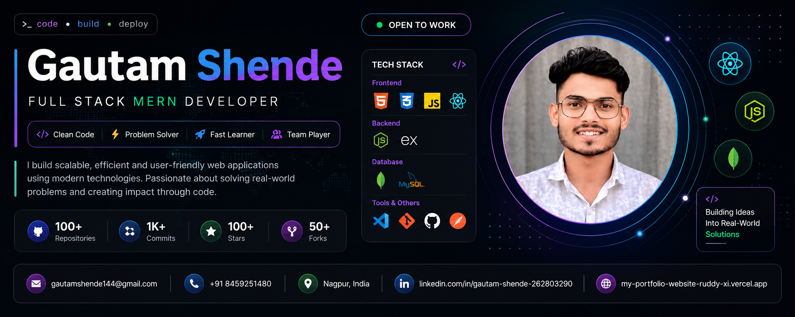

  

# 💫 About Me:
## Hi there 👋 I'm Gautam Shende and i am Fullstack Developer    🔭 I’m currently working on **Advanced Full-Stack Web Development Projects**, focusing on scalable, real-world applications.    👯 I’m looking to collaborate on **Real-World Projects**, open-source contributions, and startup-level web applications.    🤝 I’m looking for help with **system design, performance optimization, and building production-ready full-stack apps**.    🌱 I’m currently learning **Advanced JavaScript, React, Node.js, REST APIs, Databases, Authentication, and Deployment (DevOps basics)**.    💬 Ask me about **HTML, CSS, JavaScript, React, Node.js, Full-Stack Web Development, UI/UX, and Web Project Architecture**.    ⚡ Fun fact: **I love turning ideas into live web applications and debugging code more than writing it 😄** 

## 🌐 Socials:
   

# 💻 Tech Stack:

# 📊 GitHub Stats:
 
 

---

<!-- Proudly created with GPRM ( https://gprm.itsvg.in ) -->
